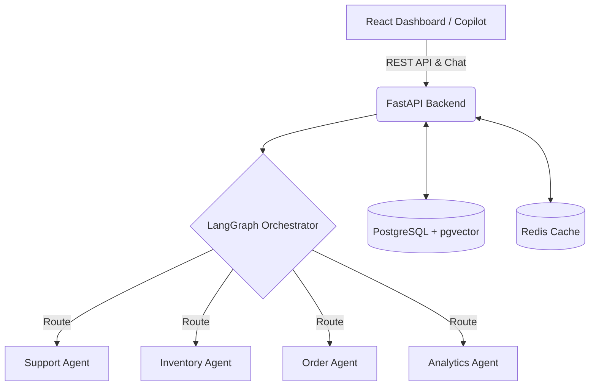

<div align="center">
  
# 🧠 ShopMind

**The Autonomous AI E-Commerce Operations Platform**

[](https://fastapi.tiangolo.com/)
[](https://reactjs.org/)
[](https://postgresql.org)
[](https://redis.io/)
[](https://www.docker.com/)

A production-grade, multi-agent AI platform built with **LangGraph** and **Google Gemini**. ShopMind centralises all e-commerce operations behind an intelligent orchestrator, featuring a premium dashboard, human-in-the-loop workflows, and real-time machine learning analytics.

[Features](#features) • [Architecture](#architecture) • [Quick Start](#quick-start) • [Documentation](#documentation)

</div>

---

## ✨ Features

- 🤖 **7-Agent AI Swarm (LangGraph):** Specialized AI agents handling everything from inventory optimization to customer support, orchestrated by a central Super Agent.
- 💬 **Omnichannel AI Copilot:** A context-aware chatbot that acts as a customer support rep for users, and a data-driven business analyst for admins.
- 🧠 **RAG-Powered Knowledge Base:** Instant answers powered by Retrieval-Augmented Generation using `pgvector`.
- 📊 **Premium Live Dashboard:** A stunning React frontend with dynamic glassmorphic UI, real-time metrics, KPI cards, and animated micro-interactions.
- 📈 **ML Demand Forecasting:** Scikit-learn powered time-series forecasting for predictive inventory management.
- 🛡️ **Human-in-the-Loop (HITL):** High-stakes AI decisions (like expensive refunds or large supplier orders) are automatically paused for human approval.
- ☁️ **Cloud Native:** Fully Dockerized with a 1-click AWS EC2 deployment script (`cloud-init`).

---

## 🏗️ Architecture

ShopMind is built on a modern, scalable tech stack:

* **Frontend:** React 18, TypeScript, Vite, Vanilla CSS (Glassmorphism UI)
* **Backend:** Python 3.11, FastAPI, SQLModel (SQLAlchemy)
* **AI & ML:** LangGraph, Google Gemini Pro, Scikit-Learn, SentenceTransformers
* **Database:** PostgreSQL (with `pgvector` for embeddings)
* **Cache & Message Broker:** Redis
* **Infrastructure:** Docker, Docker Compose, AWS EC2

### System Flow


---

## 🚀 Quick Start (Local Development)

Get the platform running on your local machine in under 5 minutes.

### Prerequisites
- Python 3.11+
- Node.js 18+ 
- Docker Desktop
- [Google Gemini API Key](https://aistudio.google.com/apikey)

### 1. Start the Databases
Spin up PostgreSQL (with pgvector) and Redis using Docker Compose:
```bash
docker-compose up -d postgres redis
```

### 2. Configure the Backend
Navigate to the backend directory, set up your environment, and start the API:
```bash
cd backend
cp .env.example .env

# Edit .env and add your GEMINI_API_KEY
python -m venv .venv
source .venv/bin/activate  # Or `.venv\Scripts\activate` on Windows
pip install -r requirements.txt

# Start the FastAPI server
uvicorn app.main:app --reload
```

### 3. Launch the Frontend
In a new terminal, start the React Vite server:
```bash
cd frontend
npm install
npm run dev
```

The stunning dashboard will be available at `http://localhost:5173`. 
*Login with `admin@shopmind.ai` (Password: `password123`)*

---

## ☁️ Cloud Deployment (AWS EC2)

ShopMind includes a production-ready, zero-touch deployment script for AWS EC2 instances running Ubuntu 24.04.

1. Launch a new EC2 instance (e.g., `t3.medium`).
2. Open port `80` (HTTP) in the Security Group.
3. Paste the contents of [`scripts/deploy_aws_ec2.sh`](scripts/deploy_aws_ec2.sh) into the **User Data** section during launch.
4. The server will automatically install Docker, clone the repo, build the images, and launch the platform on port 80.

To manually rebuild the cloud environment after code changes:
```bash
sudo docker-compose up -d --build
```

---

## 📚 Documentation

Detailed documentation and architectural diagrams are available in the `/docs` folder:

- 🏛️ **[Solution Architecture](docs/solution_architecture.md):** Complete component breakdown and data flow.
- 🗄️ **[Database Schema](docs/db_schema.md):** ER diagrams and entity descriptions.
- 💰 **[AWS Cost Estimate](docs/estimated_costing.md):** Projected run costs for MVP and Production scales.
- 📖 **[User Manual](docs/project_documentation.md):** Detailed guide on using the ShopMind platform.
- 📊 **[Pitch Deck Outline](docs/presentation_deck.md):** Recommended slides for project presentation.

---

## 🤝 Contributing
Contributions, issues, and feature requests are welcome! 
Feel free to check the [issues page](../../issues).

## 📄 License
This project is licensed under the MIT License - see the LICENSE file for details.