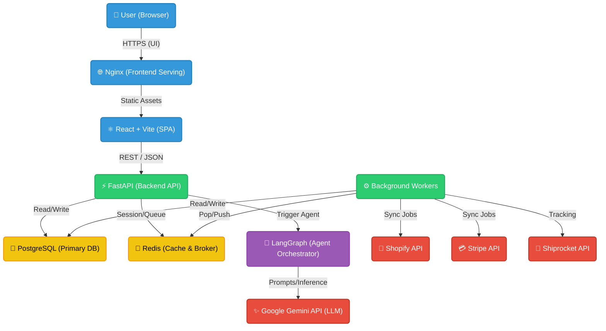

# ShopMind Solution Architecture

ShopMind is a modern, containerized, AI-powered e-commerce ERP. The architecture is designed to be highly scalable, using a decoupled frontend/backend approach, with robust asynchronous processing and dedicated AI agents.

## High-Level Architecture Diagram

## Component Breakdown

### 1. Frontend (Client-Side)
- **React 18 + Vite**: High-performance Single Page Application (SPA).
- **Architecture**: Role-based component rendering. The UI dynamically adapts based on the JWT token (Admin vs Customer Support vs Customer).
- **State Management**: React Hooks and Context for local state, API fetching via standard REST calls.

### 2. Backend (API Layer)
- **FastAPI**: Asynchronous Python web framework for serving RESTful APIs.
- **Authentication**: JWT-based session management stored in Redis for fast revocation.
- **Role-Based Access Control (RBAC)**: Dependency injection at the router level ensures endpoints are protected based on user roles.

### 3. Data Persistence & Caching
- **PostgreSQL 16**: Relational database mapping complex e-commerce logic (Users, Orders, Inventory, CRM, Logs) via **SQLModel**.
- **Redis**: In-memory data store acting as:
  1. A fast cache for AI insights and session tracking.
  2. A message broker for background tasks (e.g., Celery).

### 4. AI & Agentic Workflow
- **LangGraph**: Orchestrates multi-step AI reasoning. Instead of simple prompt-response, the AI operates as an agent that can loop, use tools, and make decisions.
- **Google Gemini API**: The core Large Language Model (LLM) powering the reasoning, sentiment analysis, and generative copywriting.
- **Human-in-the-loop (HITL)**: High-risk AI decisions are trapped in a pending state in the database, waiting for an `ADMIN` to approve or reject them via the UI.

### 5. Deployment & Cloud Topology (AWS)
- **Containerization**: Both the frontend and backend are encapsulated in Docker containers.
- **Docker Compose**: Orchestrates the local or single-node production deployment.
- **AWS Target**: The recommended deployment is on a scalable EC2 instance using the provided User Data script, or migrating to Amazon ECS (Elastic Container Service) coupled with AWS RDS for PostgreSQL.
