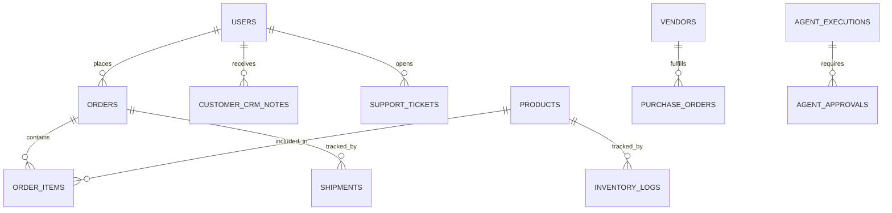

# ShopMind Database Schema

ShopMind uses PostgreSQL managed via SQLModel (SQLAlchemy under the hood). The schema is fully normalized and supports complex e-commerce, CRM, and agentic workflows.

## Entity Relationship Summary

## Core Tables

### 1. `users` (Platform Users & Customers)
Acts as the central identity table for both admin staff and end customers.
- `id`: Integer, Primary Key
- `email`: String, Unique, Indexed
- `hashed_password`: String
- `full_name`: String
- `role`: Enum (`ADMIN`, `OPS_MANAGER`, `ANALYST`, `CUSTOMER_SUPPORT`, `CUSTOMER`)
- `is_active`: Boolean
- `created_at`: DateTime
- `last_login`: DateTime (Nullable)
- `phone`: String (Nullable)
- `city`, `state`, `country`: String (Nullable)

### 2. `products`
The main catalog.
- `id`: Integer, Primary Key
- `sku`: String, Unique
- `name`: String
- `description`: Text (Often AI-generated)
- `price`: Float
- `cost_price`: Float (For profit calculations)
- `category`: String
- `stock_quantity`: Integer
- `reserved_quantity`: Integer (Stock tied up in pending orders)
- `reorder_threshold`: Integer (Trigger for AI purchasing)

### 3. `orders` & `order_items`
Financial transactions.
- **orders**
  - `id`: Integer, Primary Key
  - `user_id`: Integer, Foreign Key -> `users.id`
  - `order_number`: String, Unique
  - `status`: Enum (`PENDING`, `PROCESSING`, `SHIPPED`, `DELIVERED`, `CANCELLED`)
  - `total`: Float
  - `created_at`: DateTime
- **order_items**
  - `id`: Integer, Primary Key
  - `order_id`: Integer, Foreign Key -> `orders.id`
  - `product_id`: Integer, Foreign Key -> `products.id`
  - `quantity`: Integer
  - `price_at_time`: Float

### 4. `support_tickets`
Customer service inbox.
- `id`: Integer, Primary Key
- `user_id`: Integer, Foreign Key -> `users.id`
- `subject`: String
- `description`: Text
- `status`: Enum (`OPEN`, `IN_PROGRESS`, `RESOLVED`)
- `ai_sentiment_score`: Float (Assigned by Gemini, -1.0 to 1.0)
- `ai_summary`: Text
- `created_at`: DateTime

### 5. `agent_approvals`
Human-in-the-loop (HITL) gatekeeper table for risky AI actions.
- `id`: Integer, Primary Key
- `action_type`: String (e.g., `APPROVE_REFUND`, `CREATE_PO`)
- `risk_level`: String (`LOW`, `MEDIUM`, `HIGH`)
- `reasoning`: Text (Why the AI wants to do this)
- `status`: Enum (`PENDING`, `APPROVED`, `REJECTED`)
- `reviewed_by`: Integer, Foreign Key -> `users.id` (Nullable)

### 6. `crm_notes`
Internal staff notes on customers.
- `id`: Integer, Primary Key
- `customer_id`: Integer, Foreign Key -> `users.id`
- `text`: Text
- `author`: String (Email of the staff member)
- `created_at`: DateTime

### 7. `audit_logs`
Immutable security trail.
- `id`: Integer, Primary Key
- `event_type`: String (e.g., `LOGIN_SUCCESS`, `SESSION_REVOKED`, `PASSWORD_CHANGED`)
- `user_id`: Integer, Foreign Key -> `users.id`
- `ip_address`: String
- `detail`: Text
- `timestamp`: DateTime
